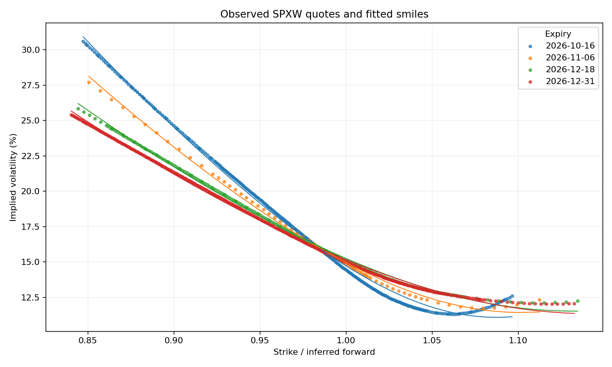

# Options pricing and risk research

Snapshot **2026-09-11 03:57:30**, assumed New York time. Treasury rate date **2026-09-10**.

## Findings

- 960 usable observed SPXW quotes across 4 selected expiries, from 6,824 in-scope source quotes.
- Maximum IV solver repricing error: 3.9e-10 index points. This is numerical inversion accuracy, not predictive accuracy.
- Four expiry smiles are fitted on 80% of strikes and checked on the remaining 20%. Read `smile_scores.csv` for actual pricing errors and bid/ask coverage.
- `hedge_baskets.csv` sizes two observed options against one target to neutralize forward delta and parallel-volatility vega locally. Entry spread costs use actual bids/asks. Fractional contracts are theoretical sizing, not executable orders.

## What the data can support

Pricing, quote-quality assessment, cross-sectional smile interpolation, numerical convergence, and local hedge sensitivities. The archive contains one snapshot, so **no historical hedge return, Sharpe ratio, or trading-profit claim is made**. The underlying last trade is 2026-09-10T16:14:59; forwards are inferred from paired quotes instead of assuming that last trade is contemporaneous.

## Read the outputs

`valuations.csv` has every accepted observed quote, IV and unit-labelled Greeks. `quote_audit.csv` preserves every in-scope row and the final acceptance/exclusion reason. `parity_audit.csv` checks whether the estimated forward lies within each paired bid/ask interval. `arbitrage_diagnostics.csv` reports raw midpoint shape violations without labelling them tradable opportunities. `tree_convergence.csv` compares an independent CRR lattice with the analytical model. `smile_validation.csv` identifies held-out strikes explicitly.

See [methodology](../../docs/OPTIONS.md) and [data provenance](../../docs/DATA.md).
