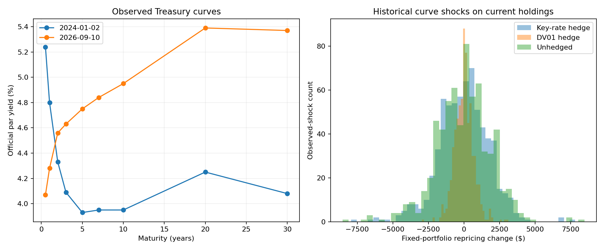

# Treasury curve and bond risk research

Valuation date **2026-09-10**. 673 official curve dates from 2024-01-02, 672 observed changes, and 5 actual Treasury note issues.

## Validation and findings

Cash-flow pricing from published auction yields reproduces actual auction clean prices to a maximum absolute error of **0.000205 per $100 face**. Current curve-derived bond prices are model estimates, not exchange quotes.

| Strategy | Shock P&L standard deviation ($) | Residual DV01 ($/bp) |
|---|---:|---:|
| key_rate_least_squares_hedge | 1,788.83 | 327.1628 |
| parallel_dv01_hedge | 670.11 | -0.0000 |
| unhedged | 1,935.94 | 358.8551 |

The target is $1 million face of the actual August 2025 five-year note. One hedge offsets parallel DV01 using the ten-year note. The other minimizes squared key-rate exposures using two- and ten-year notes. Positions are selected from current risk exposures, without fitting to historical P&L.

The historical changes are applied to a **fixed current portfolio and valuation date**. These are scenario repricing distributions, not an investment-return backtest. Financing, repo, bid/ask costs, aging, and coupons paid through historical time are excluded from this instantaneous curve-risk exercise. Rate shocks are observed; portfolio notionals and hedge rules are explicit research choices.

## Outputs

`bond_risk.csv` contains clean/dirty prices, accrued interest, parallel DV01, duration, convexity, and nine key-rate sensitivities. `cashflows.csv` traces each payment to its discounted value. `auction_price_validation.csv` compares independent yield pricing with Treasury auction results. `zero_curve_history.csv` contains model-derived rates from observed par curves. `historical_shock_repricing.csv` labels every shock with both actual source dates and its calendar gap.

See [methodology](../../docs/TREASURY.md) and [data provenance](../../docs/DATA.md).
